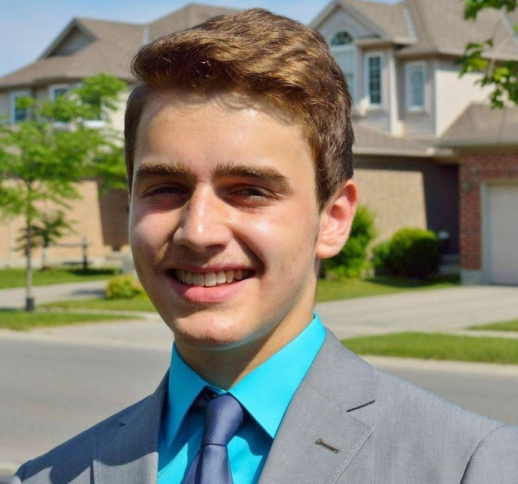
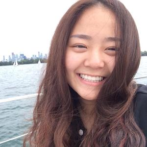

# Team Roster

[Home](README.md)   

## Carolyn Sullivan
*Your Girl Friday*

Carolyn will be participating in both the front- and back-end development of ResuMe! and coordinating them.  She is a Java and C developer focused on gaining mastery of those languages and learning more about graphics and sound applications.  As a former Respiratory Therapist and amateur writer, she has a broad education encompassing health-care and the arts as well as computer science.  When she is not offering up her time at the altar of computing, she enjoys knitting, playing with puppies, and reading Harry Potter fanfiction.

## Marlin Manka
*Front End Developer*

Marlin is a second-year Computer Science student and a graphic design enthusiast. He has experience with the Java and C Programming languages, along with a basic understanding of HTML and CSS. Ever since he began experimenting with building and designing basic websites, he has been motivated to expand his knowledge and experience in this area of development. 

## Sungyeon Hong
*Back End Developer*

Sungyeon is a Computer Science student with experience in the Java and C programming languages. She grew an interest in programming various appliactions and has pursued learning more about them. From previous job experiences, her goal is to make programs more user friendly. In her spare time she likes to look at tech from Kickstarter, sleep, and play games.

## Hejia Tang
*Database Designer*

Hejia is a third-year Computer Science student with experience in Java, C, Python, Javascript and SQL. She has more interest in information systems than software programming. She likes everything to be organised and hopes this will make her a good database designer. She enjoys watching TV shows and dramas when she is free.

## Mal Kalarus
*Front End Developer*

Mal is a second-year Computer Science student who has gained experience in Java, C, JavaScript, HTML, SQL and CSS. She is interested in graphic design and cryptography, as well as data analytics. In her spare time, she enjoys discovering the world around her by staying up-to-date on world events.

## Vincent Liu
*Front-end Developer*

Vincent is a second year Computer Science student with experience in Java, Python, C/C++, HTML and SQL. He is interested in game design and development thanks to years of gaming and modding experience. When he is not programming, Vince puts on his fly suit and goes for a couple of circuits over the city of London as he is an amateur pilot and aviation enthusiast.

## Yiming Niu
*Back-end Developer*

Yiming is a fourth-year student in Western University majoring in computer science. He knows how to use Python, C, Java and Matlab. He's interested in back-end development, especially algorithm design, and is passionate about deep learning. Learning how computer can do some task by using NN is the main job he does in his spare time.
