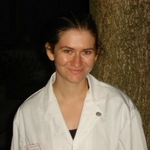
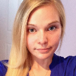

# Team Roster

[Home](README.md)   

## Carolyn Sullivan
*Project Coordinator*

Carolyn is a Java and C developer focused on gaining mastery of those languages and learning more about graphics and sound applications.  As a former Respiratory Therapist and amateur writer, she has a broad education encompassing health-care and the arts as well as computer science.  When she is not offering up her time at the altar of computing, she enjoys knitting, playing with puppies, and reading Harry Potter fanfiction.

## Marlin Manka
*Front End Developer*

Marlin is a second-year Computer Science student and a graphic design enthusiast. He has experience with the Java and C Programming languages, along with a basic understanding HTML and CSS. Ever since he began experimenting with building and designing basic websites, he has been motivated to expand his knowledge and experience in this area of development. 

## Sungyeon Hong
*Back End Developer*

Sungyeon is a Computer Science student with experiences in Java and C programing languages. She grew interest in programming from various appliactions and has pursued learning more about them. From previous job experiences, her goal is to desgin and make programs more user friendly. In her spare time she likes to look at techs from kickstarter, sleep, and play games.

## Hejia Tang
*Database Designer*

Hejia is a third- year computer science student with experiences with Java, C, Python, Javascript and SQL. She has more interests in information system than the software programming. he likes everything to be organised, hope that will make her a good database designer. And she enjoys watching TV shows and dramas when she is free.

## Mal Kalarus
*Front End Developer*

Mal is a second-year computer science student who has gained experience in Java, C, JavaScript, HTML, SQL and CSS. She is interested in graphic design and cryptography, as well as data analytics. In her spare time, she enjoys discovering the world around her by staying up to date on world events.
